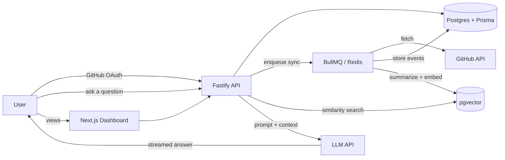

# GrowthTrace — Functional Requirements Document

2026-09-20 · @Someone

## 1. Overview & System Architecture

GrowthTrace is a multi-tenant Fastify API backed by PostgreSQL (via Prisma, with pgvector for embeddings) and Redis/BullMQ for background work, paired with a Next.js frontend.

Each user's OAuth token, events, embeddings, and jobs are scoped by `userId` throughout — there is no shared or global data view.

## 2. User Roles & Permissions

| Role | Access |
| --- | --- |
| Authenticated user | Full access to own account: dashboard, chat, sync status, disconnect GitHub, delete account/data |
| Unauthenticated visitor | Landing page and "Sign in with GitHub" only |

No admin/operator role in v1 — any operational checks (job health, error logs) happen directly against infra (Docker logs, Redis/BullMQ dashboard), not through an in-app admin UI.

## 3. Functional Requirements — Authentication & Onboarding

| ID | Requirement |
| --- | --- |
| FR-1.1 | User clicks "Sign in with GitHub" and completes the OAuth2 authorization code flow |
| FR-1.2 | On callback, the system exchanges the code for an access token and creates/updates a `User` record |
| FR-1.3 | The GitHub access token is encrypted at rest before being stored, never logged in plaintext |
| FR-1.4 | The system issues its own session (JWT or signed cookie) after successful OAuth, independent of the GitHub token's lifetime |
| FR-1.5 | On first login, the system automatically enqueues an initial full sync job for that user |
| FR-1.6 | A user can revoke access (disconnect GitHub), which stops future syncs and deletes the stored token |
| FR-1.7 | A user can delete their account, cascading deletion of their events, embeddings, and jobs |

## 4. Functional Requirements — GitHub Data Sync

| ID | Requirement |
| --- | --- |
| FR-2.1 | A per-user BullMQ job fetches commits, repos, and PRs for the connected account via the GitHub API |
| FR-2.2 | Each fetched item is deduplicated by its GitHub-native ID before being stored as an `Event`, so re-running a sync never creates duplicates |
| FR-2.3 | Sync jobs respect GitHub's rate limits across all users sharing the app's API credentials, backing off and rescheduling rather than failing silently |
| FR-2.4 | Syncs run on a recurring schedule (e.g. every few hours) plus on-demand when a user requests a manual refresh |
| FR-2.5 | A failed sync job retries with backoff and surfaces a visible "last synced" / "sync failed" status to the user |
| FR-2.6 | Sync jobs for one user never block or starve sync jobs for another user (queue is fair across tenants) |

## 5. Functional Requirements — Embedding Pipeline & RAG

| ID | Requirement |
| --- | --- |
| FR-3.1 | After each sync, every new `Event` is turned into a short natural-language summary (commit message + diff stats, or PR title/description) |
| FR-3.2 | Each summary is embedded via an embeddings API and the vector stored in pgvector, linked to its source `Event` and `userId` |
| FR-3.3 | Embedding generation is idempotent — re-summarizing an already-embedded event does not create duplicate vectors |
| FR-3.4 | A user query is embedded and matched via similarity search scoped strictly to that user's own vectors (no cross-user retrieval) |
| FR-3.5 | The top-N most relevant events are assembled into a prompt context for the LLM, with the raw retrieved events available for the response to reference |
| FR-3.6 | The core RAG pipeline (embed → store → retrieve → prompt) is implemented with direct API calls first; a LangChain.js version is built only afterward, as an optional comparison, not a dependency of the shipped path |

## 6. Functional Requirements — Conversational AI / Chat

| ID | Requirement |
| --- | --- |
| FR-4.1 | A user can type a natural-language question about their own history in a chat interface |
| FR-4.2 | The system retrieves relevant events (FR-3.4/3.5) and generates an answer grounded in that retrieved context |
| FR-4.3 | The answer is streamed token-by-token to the frontend rather than returned all at once |
| FR-4.4 | Chat history for a session is retained so follow-up questions have conversational context |
| FR-4.5 | If no relevant events are found for a query, the system says so rather than fabricating an answer |

## 7. Functional Requirements — Dashboard & UI

| ID | Requirement |
| --- | --- |
| FR-5.1 | Dashboard shows a chronological timeline of derived events/milestones |
| FR-5.2 | Dashboard shows derived stats: current streak, longest streak, monthly shipped count, most-active repo |
| FR-5.3 | Dashboard shows last-synced time and a manual "sync now" action |
| FR-5.4 | Chat UI is accessible from the dashboard and shows streamed responses with clear loading/streaming states |
| FR-5.5 | UI is built in Next.js using functional components only, styled with Tailwind |

## 8. Non-Functional Requirements

| ID | Requirement |
| --- | --- |
| NFR-1 | GitHub tokens and any other credentials are encrypted at rest; secrets never committed to the repo |
| NFR-2 | Every database query touching `Event`, `Embedding`, or user profile data is scoped by `userId`; no query pattern can return another user's rows |
| NFR-3 | Chat responses begin streaming within \~2–3 seconds of a query under normal load |
| NFR-4 | Sync jobs are resilient to individual API failures — one failed request does not fail the whole job |
| NFR-5 | The system runs fully via Docker Compose for local dev and self-hosted deployment |
| NFR-6 | Logs never contain raw tokens, full prompts with sensitive content, or other users' data |

## 9. Data Model (Overview)

| Table | Key fields | Notes |
| --- | --- | --- |
| `User` | id, githubId, email, createdAt | One row per signed-up user |
| `GithubAccount` | userId, encryptedAccessToken, tokenUpdatedAt | 1:1 with `User`; token encrypted at rest |
| `Event` | id, userId, githubEventId, type, summaryText, occurredAt | Deduped by `githubEventId`; source of truth for dashboard stats |
| `EventEmbedding` | id, eventId, userId, vector (pgvector) | Embedding of `Event.summaryText`, scoped by `userId` for retrieval |
| `SyncJob` | id, userId, status, startedAt, finishedAt, error | One row per sync run, for status/history display |
| `ChatMessage` | id, userId, role, content, createdAt | Session history for follow-up context |

## 10. API Endpoint Summary

| Method & path | Purpose |
| --- | --- |
| `GET /auth/github` | Redirect to GitHub OAuth authorization |
| `GET /auth/github/callback` | Exchange code for token, create session |
| `POST /auth/logout` | End session |
| `GET /me` | Current user profile + sync status |
| `POST /sync` | Manually trigger a sync job for the current user |
| `GET /events` | Paginated event list for dashboard timeline |
| `GET /stats` | Derived stats (streaks, monthly counts, top repo) |
| `POST /chat` | Send a message; streams a RAG-grounded response |
| `DELETE /account` | Delete account and cascade all owned data |

## 11. Out of Scope (v1)

- Non-GitHub data sources (GitLab, Jira, calendars, etc.)
- Multi-user teams, shared dashboards, leaderboards, or any cross-user comparison
- Billing, subscriptions, or usage-based pricing
- Native mobile app (React Native)
- Admin/operator dashboard inside the product
- LangChain as a required dependency of the shipped RAG path
- Fine-tuning or hosting a custom LLM
