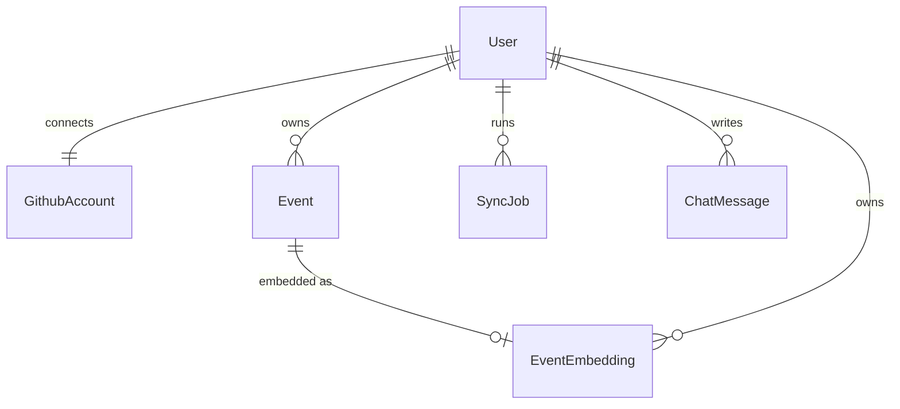

# Data model

> Status: Planned (per FRD §9). Update when the Prisma schema lands. **TODO:** replace this page with a walkthrough of `backend/prisma/schema.prisma` once it exists, and keep only the rationale here.

Covers: FR-1.x (accounts and tokens), FR-2.x (events and sync runs), FR-3.2/3.3 (embeddings), FR-4.4 (chat history), FR-1.6/1.7 (disconnect and account deletion), NFR-1, NFR-2.

The model is deliberately small: one user, the GitHub account behind them, the events derived from GitHub, one embedding per event, a record of each sync run, and chat history. **Every table except `User` carries `userId`**, which is what makes per-tenant scoping enforceable ([multi-tenancy](multi-tenancy.md)).

## Entities

| Entity           | Key fields                                                                             | Relations and rules                                                                                                                             |
| ---------------- | -------------------------------------------------------------------------------------- | ----------------------------------------------------------------------------------------------------------------------------------------------- |
| `User`           | `id`, `githubId` (unique), `email`, `createdAt`                                        | The tenant. Created on first OAuth login, and deleting it cascades to everything below                                                          |
| `GithubAccount`  | `userId` (unique), `encryptedAccessToken`, `tokenUpdatedAt`                            | 1:1 with `User`. The token is encrypted at the application layer before insert (NFR-1); it is never selected outside the sync/auth code         |
| `Event`          | `id`, `userId`, `githubEventId`, `type`, `repo`, `summaryText`, `occurredAt`           | Many per user. **Unique on (`userId`, `githubEventId`)**, so re-syncs upsert instead of duplicating (BR-6). Source of truth for dashboard stats |
| `EventEmbedding` | `id`, `eventId` (unique), `userId`, `vector vector(768)`, `model`                      | At most one per event (FR-3.3: re-embedding replaces it). `userId` is denormalised so vector search can filter without a join                   |
| `SyncJob`        | `id`, `userId`, `status`, `startedAt`, `finishedAt`, `itemsOk`, `itemsFailed`, `error` | One row per sync run, for `SyncStatus` and history. Status is `queued`/`running`/`succeeded`/`partial`/`failed` (see [sync jobs](sync-jobs.md)) |
| `ChatMessage`    | `id`, `userId`, `sessionId`, `role`, `content`, `createdAt`                            | Conversation history for follow-ups (FR-4.4). `sessionId` groups one conversation                                                               |

`repo`, `model`, `itemsOk`/`itemsFailed` and `sessionId` go beyond the FRD's key fields. They're proposed here because the dashboard (most-active repo), re-embedding on model change, partial-sync reporting and multi-conversation chat need them.

## Indexes

| Table            | Index                                  | Why                                                         |
| ---------------- | -------------------------------------- | ----------------------------------------------------------- |
| `User`           | unique `githubId`                      | Login lookup                                                |
| `GithubAccount`  | unique `userId`                        | 1:1                                                         |
| `Event`          | unique (`userId`, `githubEventId`)     | Idempotent upsert                                           |
| `Event`          | (`userId`, `occurredAt` DESC)          | Timeline pagination and streak/monthly stats                |
| `EventEmbedding` | unique `eventId`                       | One vector per event                                        |
| `EventEmbedding` | (`userId`)                             | Tenant pre-filter for small users                           |
| `EventEmbedding` | HNSW on `vector` (`vector_cosine_ops`) | Similarity search ([RAG pipeline](rag-pipeline.md#2-store)) |
| `SyncJob`        | (`userId`, `startedAt` DESC)           | Latest sync status                                          |
| `ChatMessage`    | (`userId`, `sessionId`, `createdAt`)   | Load a conversation in order                                |

The rule: **every index on a tenant-owned table leads with `userId`** (except unique keys that are already globally unique, like `eventId`). Then the tenant filter is always the cheapest predicate.

## Deletion (FR-1.7)

`DELETE /account` deletes the `User` row. All other tables reference it with `ON DELETE CASCADE`, so one statement removes the token, events, vectors, sync history and chat. Queued jobs for that user find no `User` and exit (see [sync jobs](sync-jobs.md#idempotency)).
