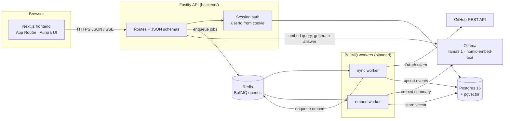
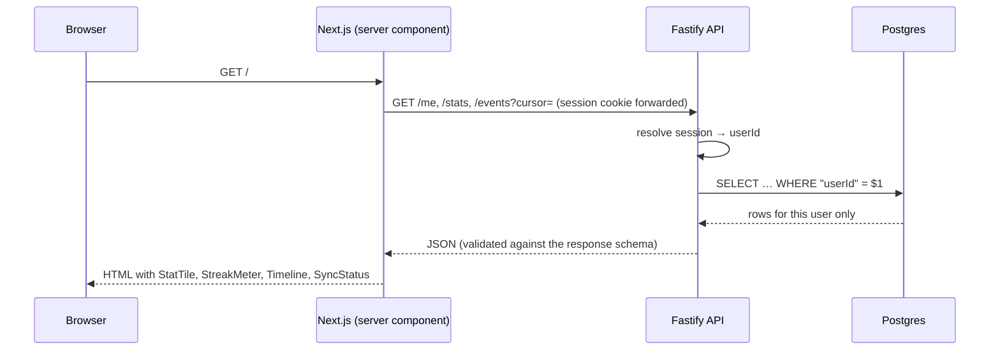
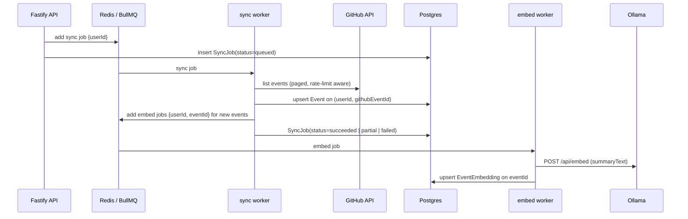

# Architecture overview

> Status: Partly built. The frontend shell, the design system and the Fastify app (`GET /health` only) exist. Auth, Prisma, sync workers and RAG are planned per the [FRD](../product/FRD.md) and the [BRD timeline](../product/BRD.md#8-timeline--milestones). Update this page as each piece lands.

GrowthTrace connects to a user's GitHub account, syncs their activity into Postgres, embeds a summary of each event into pgvector, and answers questions about that history with a locally hosted LLM. Every piece runs under Docker Compose on our own infrastructure (BR-7, NFR-5), and every piece of user data is scoped to one user (BR-3, NFR-2).

## System diagram

## Components

| Component  | Code / image                       | Port (host)            | Responsibility                                                                                                       |
| ---------- | ---------------------------------- | ---------------------- | -------------------------------------------------------------------------------------------------------------------- |
| Frontend   | `frontend/` (Next.js)              | 3000 (dev)             | Dashboard, chat UI, `/design`. Reads the API via `API_BASE_URL` / `NEXT_PUBLIC_API_BASE_URL`                         |
| API        | `backend/` (Fastify, `buildApp()`) | 4000 (`PORT`)          | Auth, JSON endpoints, chat streaming, enqueueing jobs. Schemas drive the [API docs](../api/endpoints.md)             |
| Workers    | `backend/` (planned)               | —                      | BullMQ consumers for sync and embedding ([sync jobs](sync-jobs.md))                                                  |
| Postgres   | `pgvector/pgvector:pg16`           | 5533 (`POSTGRES_PORT`) | All app data and vectors ([data model](data-model.md))                                                               |
| Redis      | `redis:7-alpine`                   | 6480 (`REDIS_PORT`)    | BullMQ queues, job state, rate-limit state                                                                           |
| Ollama     | `ollama/ollama:latest`             | 11434                  | Chat generation (`llama3.1`) and embeddings (`nomic-embed-text`), [ADR 0001](../adr/0001-llm-embeddings-provider.md) |
| GitHub API | external                           | —                      | Source of commits, PRs and repos via the user's OAuth token                                                          |

## Request flow: dashboard load

What happens when a signed-in user opens the dashboard (FR-5.1–5.3):

The `userId` comes **only** from the session, never from the URL or body. See [multi-tenancy](multi-tenancy.md).

## Async flow: sync → embed

What happens after login, on a schedule, or on **Sync now** (FR-2.x, FR-3.1–3.3):

Chat (FR-4.x) reuses these pieces synchronously: embed the question, run a `userId`-filtered similarity search, build a grounded prompt, and stream `llama3.1` tokens back to the browser. See the [RAG pipeline](rag-pipeline.md).

## Cross-cutting rules

- **Tenancy:** every row, query, vector search and job payload carries `userId` ([multi-tenancy](multi-tenancy.md)).
- **Secrets:** GitHub tokens are encrypted at rest. Logs never contain tokens, full prompts or another user's data (NFR-1, NFR-6).
- **Schemas first:** every API route declares request and response JSON schemas (TypeBox). `buildApp()` refuses a route without a response schema, and the [API docs](../api/endpoints.md) are generated from those schemas ([ADR 0003](../adr/0003-quality-gates-and-tooling.md)).
- **UI:** built only from Aurora ([ADR 0002](../adr/0002-aurora-design-system.md)).
