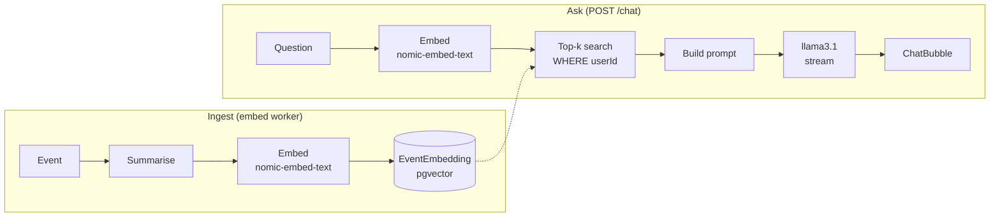

# RAG pipeline

> Status: Planned (per FRD §5–6 and the BRD Week 3–4 milestones). Update when the embedding worker and `POST /chat` land.

Covers: BR-4, BR-8, FR-3.1–3.6, FR-4.1–4.5, NFR-2, NFR-3, NFR-6. Provider decision: [ADR 0001](../adr/0001-llm-embeddings-provider.md) (Ollama: `llama3.1` for chat, `nomic-embed-text` for embeddings).

The chat answers questions about _your own_ GitHub history, grounded in events retrieved from your own vectors. The pipeline is built with direct HTTP calls to Ollama and SQL to pgvector; any LangChain.js version comes later, only as a comparison (FR-3.6).



## 1. Embed

**What gets embedded.** One short natural-language summary per `Event` (FR-3.1), stored in `Event.summaryText`, for example:

> `2026-09-14 · growth-trace · commit: "Phase 3: Aurora design system" (+1,204 −87 across 41 files)`
>
> `2026-09-20 · growth-trace · PR #3 merged: "Phase 4: responsive design" — make every Aurora component work from 320px to 3840px…`

Summaries are built deterministically from the GitHub payload (message or title, repo, date, diff stats, and the first ~500 characters of a PR description), not by the LLM. That keeps ingestion cheap and reproducible.

**Chunking.** One event is one chunk. Summaries are short (well under `nomic-embed-text`'s 2,048-token context), so no splitting is needed. Long PR descriptions are truncated rather than split, because one event should be one retrievable fact. If we later embed long text (PR review threads), chunk it at about 512 tokens with about 64 tokens of overlap and keep `eventId` on each chunk.

**Model.** `nomic-embed-text` produces **768-dimension** vectors. It expects task prefixes: documents are embedded as `search_document: <summary>`, questions as `search_query: <question>`. Using the same model and prefixes on both sides matters more than anything else for retrieval quality. Each embedding records its `model`, so a model change can trigger re-embedding.

**Idempotency.** One embedding per event (unique `eventId`, upsert). Re-summarising an embedded event replaces its vector instead of adding a second (FR-3.3). See [sync jobs](sync-jobs.md#idempotency).

## 2. Store

- Column `EventEmbedding.vector vector(768)`, with `userId` stored next to it ([data model](data-model.md)).
- Index: **HNSW** with `vector_cosine_ops` (`m = 16`, `ef_construction = 64`, pgvector defaults). HNSW was chosen over IVFFlat because it needs no training step and keeps good recall as data is inserted incrementally, which is how sync works.
- Distance: cosine (`<=>`). Nomic embeddings are meant to be compared by cosine similarity.

## 3. Retrieve

The question is embedded (`search_query:` prefix), then:

```sql
SELECT e.id, e."summaryText", e."occurredAt", 1 - (v.vector <=> $2) AS score
FROM "EventEmbedding" v
JOIN "Event" e ON e.id = v."eventId" AND e."userId" = $1
WHERE v."userId" = $1
ORDER BY v.vector <=> $2
LIMIT $3;          -- k = 8
```

- **Tenant filter inside the query** (FR-3.4, NFR-2), never after it. See [multi-tenancy](multi-tenancy.md#vector-search-scoping). Raise `hnsw.ef_search` (or enable iterative scans) so the filtered search still returns k rows.
- **k = 8**, then drop results below a similarity floor (start at 0.5 and tune with real questions). If nothing passes the floor, the answer is "no relevant activity found" (FR-4.5). The LLM isn't called to improvise.
- **Time-aware questions** ("what did I ship in June") also get a date-range filter on `occurredAt`, parsed from the question, combined with the vector search. Pure similarity is weak at dates.

## 4. Prompt

```text
[system]
You are GrowthTrace, answering questions about one developer's own GitHub activity.
Use ONLY the events below. Each has an id like [E3].
- Cite the events you use, inline, as [E1], [E3].
- If the events don't answer the question, say so plainly. Never invent commits, PRs, repos or dates.
- Be concise. Prefer concrete numbers and dates from the events.

Events (most relevant first):
[E1] 2026-09-20 · growth-trace · PR #3 merged: "Phase 4: responsive design" …
[E2] …

[history]  last N turns of this ChatMessage session (FR-4.4), trimmed to a token budget

[user]
<question>
```

**Grounding and citation rules:**

- The model sees only retrieved events. Every factual claim must carry an `[E#]` citation.
- The API maps `[E#]` back to event IDs and returns them with the stream, so the UI can link each citation to the event in the timeline (FR-3.5).
- No retrieved events means no LLM call; return the fixed "nothing found" answer (FR-4.5).
- Prompts and answers are not logged in full (NFR-6). Log `userId`, the retrieved event IDs, timings and token counts only.

## 5. Generate and stream

`POST /chat` calls Ollama's `/api/chat` with `model: llama3.1` and `stream: true`, and relays tokens to the browser as Server-Sent Events (FR-4.3). The client renders them in a `ChatBubble` with `streaming` set until the final event. The user message and the full answer are stored as `ChatMessage` rows after the stream ends.

## Latency budget (NFR-3)

The first token should reach the browser within about 2–3 seconds:

| Step                                | Budget      |
| ----------------------------------- | ----------- |
| Auth + load history                 | ≤ 50 ms     |
| Embed question (`nomic-embed-text`) | ≤ 150 ms    |
| Vector search (HNSW, one user)      | ≤ 50 ms     |
| Build prompt                        | ≤ 10 ms     |
| `llama3.1` time-to-first-token      | ≤ 1.5–2 s   |
| **Total to first token**            | **≤ 2.5 s** |

Most of the budget is model prefill, which grows with prompt length. Keeping k small and history trimmed is the main lever. Keep the models loaded in Ollama (`keep_alive`) so the first question after idle doesn't pay a cold-load penalty. If `llama3.1` can't meet the budget on our hardware, ADR 0001 names the fallbacks: a smaller or quantised model, or a hosted API.
